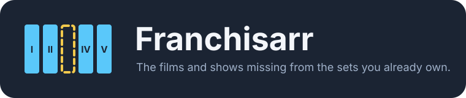
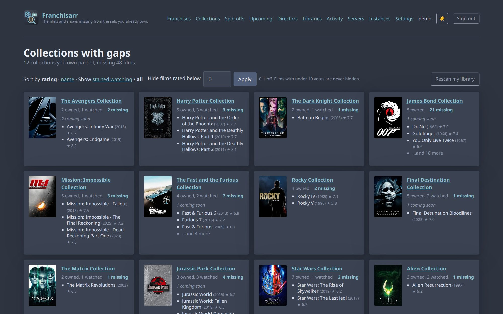
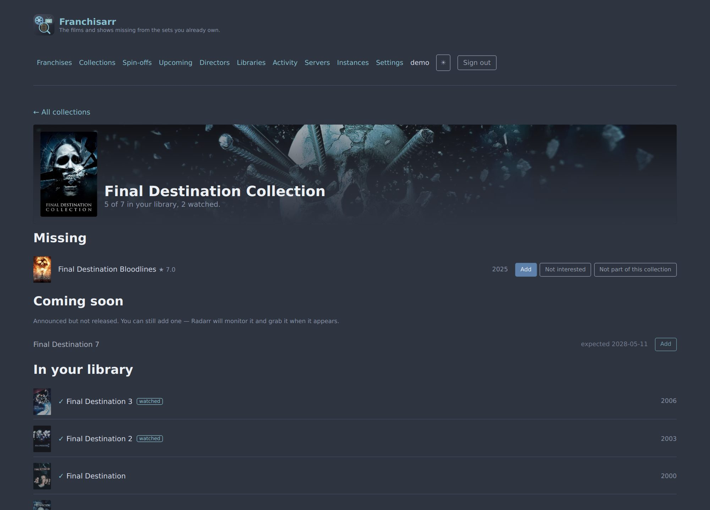
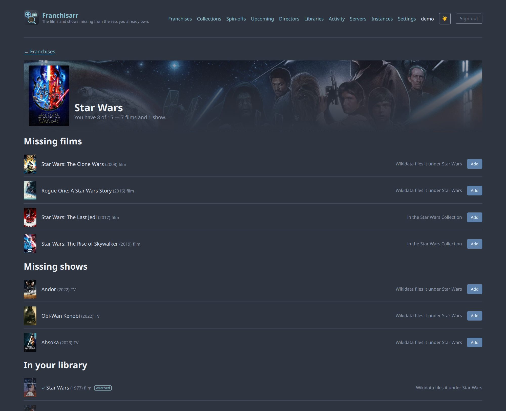
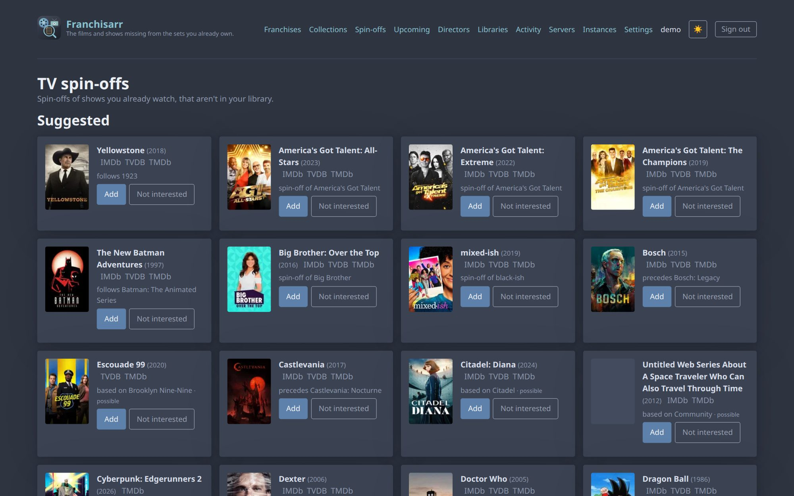
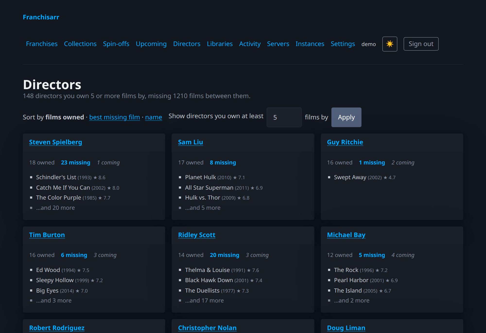
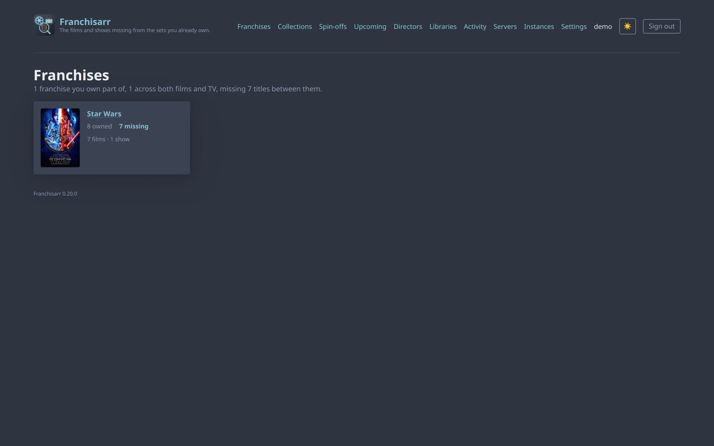
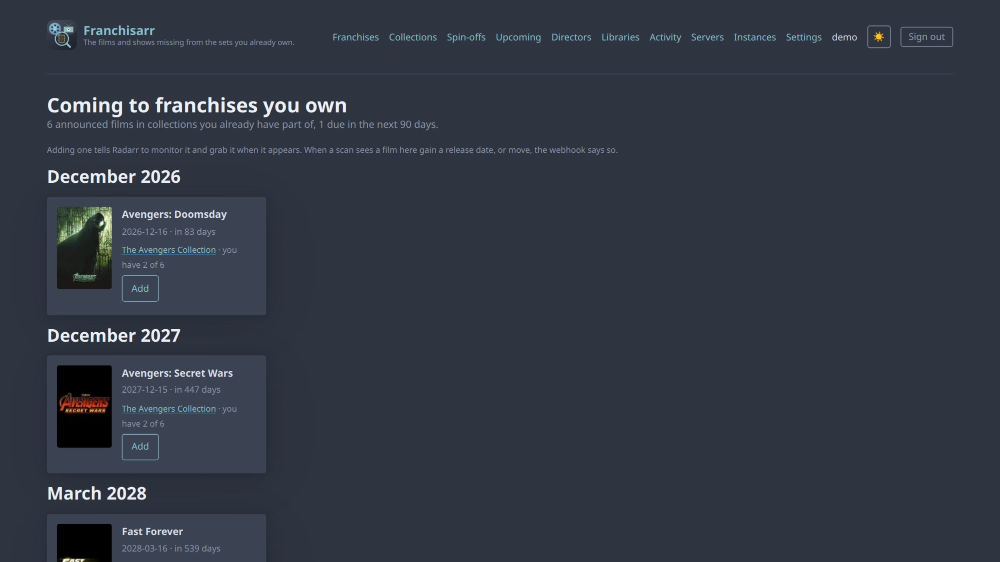
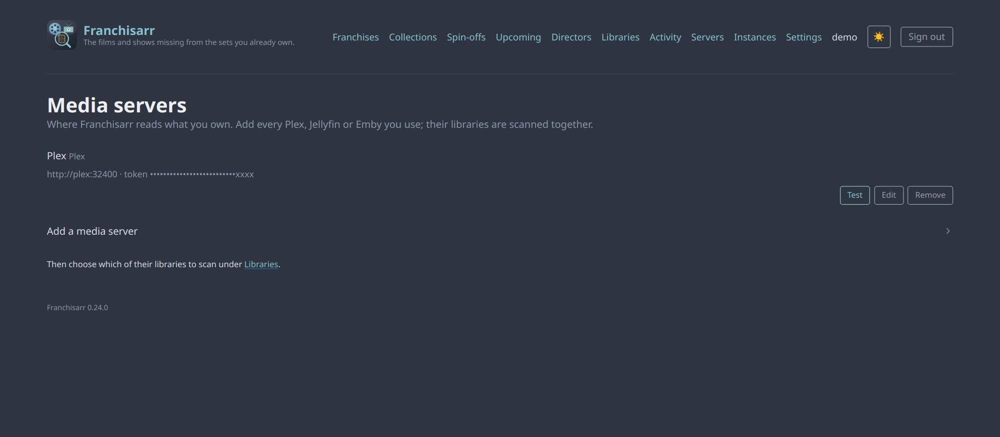
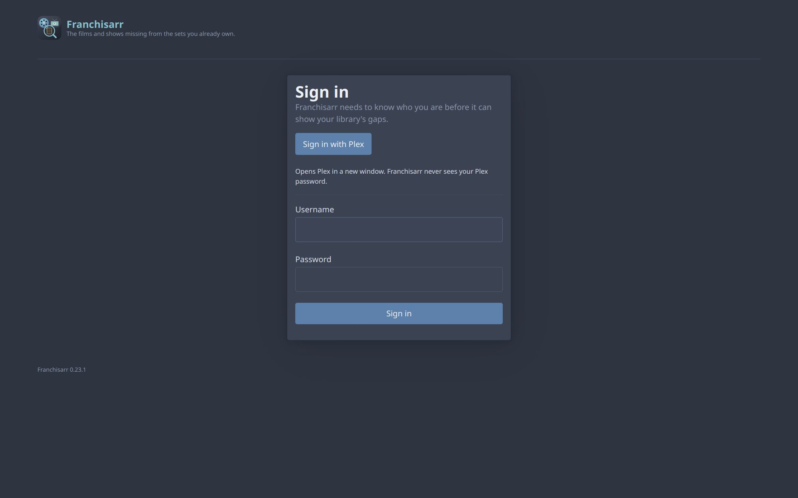

<p align="center"></p>

# Franchisarr

Franchisarr looks at your **Plex, Jellyfin or Emby** library and finds two things you probably
want and don't have:

- **Films missing from collections you already own part of.** You have *Beverly Hills Cop* and
  *II* but not *III* — one click sends it to Radarr.
- **Spin-offs of shows you already watch.** You have *NCIS* but not *NCIS: Los Angeles* — one
  click sends it to Sonarr. Found through Wikidata, so it also knows *Family Guy* → *American
  Dad!* and *Serenity* → *Firefly*, which no name search could.

And, built on the same data: **franchise pages** that put films and TV together (*Star Trek —
you have 6 of 27*), **director pages** (*you own 11 Nolan films; missing* Following *and*
Insomnia), an **Upcoming** page of announced films in franchises you own with release-date
notifications, and **import lists** Radarr and Sonarr can poll so you never have to click Add.

It reads all three — one of them or several at once, with a film on any of them counting as
owned and a tick on what you've watched — supports multiple Radarr and Sonarr instances, signs
you in with your media-server account, scans on a schedule,
tells you when it finds something new — Discord, Slack, or anything
[Apprise](https://github.com/caronc/apprise) reaches (Telegram, Pushover, ntfy, email, a hundred
more) — wears your
[theme.park](https://theme-park.dev) theme like the rest of your stack, and has a web UI and a
CLI. Everything
it hides — low-rated films, TV specials, shorts — is a preference, folded away rather than
deleted.

Franchisarr owes its starting idea to [Gaps](https://github.com/JasonHHouse/gaps), which has
found missing collection films in Plex since 2019. This is that idea extended to Jellyfin and
Emby, to TV spin-offs and cross-media franchises, and to import lists the *arrs poll themselves.

**Status:** pre-1.0 and in daily use against a real library of ~3,400 films and ~660 shows.
Images are published to GHCR for amd64 and arm64.

**How it was built:** with heavy use of Claude Code, directed, tested and reviewed by a human.
Every feature was measured against that real library before it shipped — the numbers are in the
[changelog](CHANGELOG.md) — there are ~900 tests with no live network calls, and the full git
history was scanned for secrets before the repo went public. The code is MIT; read it.

## What it looks like

<p align="center"></p>

| Collection detail | Franchise |
|---|---|
|  |  |

| TV spin-offs | Directors |
|---|---|
|  |  |

<details>
<summary>More: franchises, upcoming, media servers, sign-in</summary>






</details>

## Quick start

```bash
mkdir franchisarr && cd franchisarr
curl -fsSLO https://raw.githubusercontent.com/prophetizer/franchisarr/master/docker-compose.yml
curl -fsSL https://raw.githubusercontent.com/prophetizer/franchisarr/master/.env.example -o .env
# edit .env — at minimum: your media server (PLEX_URL+PLEX_TOKEN, or JELLYFIN_URL+JELLYFIN_API_KEY,
#   or EMBY_URL+EMBY_API_KEY), TMDB_API_KEY, ADMIN_USERNAME, ADMIN_PASSWORD
docker compose up -d
```

The image is `ghcr.io/prophetizer/franchisarr` (`latest`, or a version like `0.10.0`). To build
from source instead, clone the repository and change `image:` to `build: .` in the compose file.

Then open <http://localhost:8000>, sign in, choose which libraries to scan, and run a scan.

You need a **TMDb API key** — the free v3 one from
[themoviedb.org/settings/api](https://www.themoviedb.org/settings/api). Note it's the *shorter*
value on that page; the v4 Read Access Token won't work, and Franchisarr will tell you so if you
paste it by mistake.

### Unraid

**Coming, after more testing.** A Community Applications template is drafted in
[`contrib/unraid/`](contrib/unraid/), but it hasn't been run on Unraid yet, so it isn't
recommended. Until then it runs on Unraid like any other container: image
`ghcr.io/prophetizer/franchisarr`, port 8000, a path mapped to `/config`, and the environment
variables from the Configuration table below.

## Configuration

Everything can be set in the app's Settings page. Environment variables are a convenience for
docker-compose deployments and are only read on first boot — after that the database wins, so
changing a variable later has no effect. See [`.env.example`](.env.example) for the full list.

| Variable | Purpose |
|---|---|
| `PLEX_URL`, `PLEX_TOKEN` | Your Plex server |
| `JELLYFIN_URL`, `JELLYFIN_API_KEY` | Your Jellyfin server (Dashboard → API Keys) |
| `EMBY_URL`, `EMBY_API_KEY` | Your Emby server |
| `MEDIA_SERVER` | Optional: seed only `plex`, `jellyfin` or `emby` when several pairs are set |
| `TMDB_API_KEY` | Your own free v3 key |
| `FANART_API_KEY` | Optional; adds franchise logos to collection headings |
| `SHOW_ARTWORK` | `false` turns off all poster and logo images |
| `RADARR_URL`, `RADARR_API_KEY` | Optional first Radarr; more can be added in the UI |
| `SONARR_URL`, `SONARR_API_KEY` | Optional first Sonarr |
| `ADMIN_USERNAME`, `ADMIN_PASSWORD` | Fallback login, created on first boot only |
| `BASE_URL` | e.g. `/franchisarr` when behind a reverse proxy subpath |
| `SCAN_SCHEDULE_CRON` | e.g. `0 3 * * *`; empty disables scheduled scans |
| `TZ` | Which timezone the schedule runs in |
| `PUID`, `PGID` | Ownership of the config volume, as in the linuxserver.io images |

### Spin-offs

Spin-offs of shows you own are discovered from [Wikidata](https://www.wikidata.org) during a
scan — no key or account needed — and matched on TMDb ids rather than titles, so it finds the
ones whose names give nothing away (*Family Guy* → *American Dad!*). Weaker evidence is marked
*possible*, and nothing is ever added without you clicking.

### Import lists for Radarr and Sonarr

Rather than clicking Add per film, let the *arrs pull from Franchisarr. Under **Settings →
Import lists**, generate a key; then in Radarr, *Settings → Import Lists → Add → Custom List*
and paste a films URL, for example:

```
https://franchisarr.example.com/api/lists/films.json?api_key=YOUR_KEY&min_rating=7
```

Sonarr takes the `shows` URL the same way. Radarr's own settings then decide what to monitor
and where — Franchisarr never adds anything itself. Your dismissals and preferences apply to the
lists; `min_rating` on the URL overrides the household floor for that list only.

### Artwork

Collection screens show posters from TMDb. Adding a free
[fanart.tv key](https://fanart.tv/get-an-api-key/) additionally puts the franchise wordmark over
a backdrop at the top of each collection — the only thing that key is used for.

Both are fetched by the browser from `image.tmdb.org` and `assets.fanart.tv`, so a client with no
internet access, or anyone who would rather nothing left their network, can set
`SHOW_ARTWORK=false` for a text-only interface.

### Connecting to Radarr and Sonarr

Use their address on your own network, not a public one:

```yaml
services:
  franchisarr:
    networks: [arrs]          # the network Radarr and Sonarr are already on
networks:
  arrs:
    external: true
```

```
RADARR_URL=http://radarr:7878
SONARR_URL=http://sonarr:8989
```

A public URL behind a login proxy — Authelia, Authentik, Cloudflare Access — will **not** work:
those answer API requests with a login page, and an API key can't get past one. Franchisarr says
so rather than blaming your API key. If you'd rather keep the public URL, add a bypass rule in
the proxy for `/api` so API-key requests are let through.

## Seerr

If your household routes requests through [Seerr](https://github.com/seerr-team/seerr) — or the
Overseerr or Jellyseerr it grew out of — add it on the Instances page (Settings → General → API
Key there). Every Add dialog then offers **Request via Seerr** next to the direct Radarr/Sonarr
choice: Seerr picks the *arr, profile and folder from its own settings, and the request shows up
in Seerr's history like any other. Open requests keep a title out of the lists the way a queued
Radarr add does; declined and failed ones come back, since those are worth asking again.

One thing to know: Seerr's API key acts as its **administrator**, and administrators' requests
are approved automatically. So a request made from Franchisarr normally goes straight through
rather than waiting for someone to approve it — the result in the dialog says which happened.

Jellyseerr was renamed **Seerr** in 2026 and Overseerr was archived that February. All three
speak the same `/api/v1`, so an older instance keeps working — pick which one you run when you
add it, and it's only the label that changes.

## Calendar

The Upcoming page is also an iCalendar feed, so announced films in franchises you own appear in
your calendar app — one all-day event per film, with the collection and how much of it you have:

```
https://franchisarr.example/api/lists/upcoming.ics?api_key=YOUR_KEY
```

Apple Calendar: File → New Calendar Subscription. Google Calendar: Other calendars → From URL.
Same key as the import lists (Settings → Import lists), and the URL is shown there. It refreshes
daily; films with no date yet appear once TMDb gives them one.

## Notifications

After a scheduled scan that finds something new — never every run — Franchisarr sends one
message. Settings → Notifications takes a Discord or Slack webhook, a generic JSON webhook for
your own automation, or **Apprise URLs**, one per line (`tgram://…`, `pover://…`, `ntfy://…`,
`mailto://…`; the [Apprise wiki](https://github.com/caronc/apprise/wiki) lists every service),
delivered from inside the app. If you already run
[apprise-api](https://github.com/caronc/apprise-api), point it at that instead and keep the
destinations there. The URL is treated as a credential: redacted in logs and in the redacted
config export.

## Dashboard widget

`/api/lists/stats.json?api_key=…` returns the headline numbers as one flat document — collections
with gaps, missing films, spin-offs, upcoming films, incomplete franchises, directors, library
size, last scan — cached for a minute. For [Homepage](https://gethomepage.dev):

```yaml
- Franchisarr:
    icon: https://raw.githubusercontent.com/prophetizer/franchisarr/master/docs/brand/icon-512.png
    href: https://franchisarr.example.com
    widget:
      type: customapi
      url: https://franchisarr.example.com/api/lists/stats.json
      headers:
        X-Api-Key: your-key
      refreshInterval: 300000
      mappings:
        - field: missing_films
          label: Missing films
          format: number
        - field: collections_with_gaps
          label: Collections
          format: number
        - field: missing_spinoffs
          label: Spin-offs
          format: number
        - field: upcoming_films
          label: Upcoming
          format: number
```

The key is the one from Settings → Import lists; the header keeps it out of your dashboard's
URL list, but `?api_key=` works too for widgets that can't send headers.

## Signing in

**Sign in with your media server account.** For Plex that is the usual OAuth button, and
Franchisarr never sees your Plex password; only accounts that can actually reach *your* Plex
server are admitted, so having a Plex account isn't enough. For Jellyfin and Emby it is a
username and password, checked against the server itself. Who administers Franchisarr follows
from the server: with Plex it's the server's owner, with Jellyfin and Emby it's anyone who is an
administrator there. Everyone else gets an ordinary account with their own dismiss list.

The local admin account from `ADMIN_USERNAME`/`ADMIN_PASSWORD` is the fallback for when no server
is configured yet, or plex.tv is unreachable. It's created on **first boot only**, so changing those
variables later has no effect — if you forget the password:

```bash
docker exec -it franchisarr python scripts/reset_admin_password.py            # lists accounts
docker exec -it franchisarr python scripts/reset_admin_password.py michael    # prompts for a new one
```

If no sign-in button is offered, Franchisarr couldn't reach your server at startup — with Plex
it has to know which server it belongs to before it can check that an account is allowed in.
Press **Test** on the server under *Servers*, or check that server's address and key and
restart.

### Several servers

Every filled-in pair in `.env` becomes a server, and more can be added under **Servers** in the
app (name, address, key; a *watched as* username for Jellyfin/Emby, since an API key belongs to
nobody). Their libraries are chosen together on the Libraries page and scanned in one pass. A
film on two servers is owned once; its detail row says which servers hold it. Watched films get a
tick, and the Collections page can be filtered to franchises you've actually started.

## Command line

The CLI talks to Franchisarr's own API, so it works through `docker exec` or from anywhere that
can reach the app.

```bash
export FRANCHISARR_URL=http://localhost:8000
export FRANCHISARR_API_KEY=...          # Settings, or `cli.py api-key`
python cli.py scan movies
python cli.py gaps
python cli.py add 176 --instance 1
```

`scan movies` / `scan tv` walk your libraries; `gaps` and `spinoffs` list what's missing;
`review` shows matches that need confirming; `add`, `add-show` and `add-collection` send things to
Radarr/Sonarr; `instances` and `activity` inspect the rest.

## Theming

Nord (dark) by default, with a light toggle to Nord's light half. [theme.park](https://theme-park.dev) themes are set by
environment variable, using theme.park's own names — so if your stack already sets these,
Franchisarr picks the theme up with no per-app configuration:

```yaml
environment:
  TP_THEME: nord
  TP_DOMAIN: theme-park.dev     # or your own self-hosted copy
  TP_SCHEME: https
  TP_COMMUNITY_THEME: "false"
```

`THEME_CSS_URL` overrides those with a literal stylesheet URL.

If you theme centrally by injecting a stylesheet at the proxy — nginx `sub_filter`, a Traefik
plugin, theme.park's Docker mod — that works with **nothing set here at all**. Franchisarr always
loads a small adapter mapping theme.park's custom properties onto the ones it paints with, so an
injected theme-options stylesheet takes effect on its own. The whole page follows the theme,
header icon included — verified against all eleven official theme options
([screenshots](contrib/theme-park/screenshots)).

Franchisarr's *base* stylesheet — the one a proxy or the theme.park mod injects when you point
it at `app=franchisarr` — was
[merged into theme.park](https://github.com/themepark-dev/theme.park/pull/737) on 2026-09-22.
It is on their `develop` branch, so `develop.theme-park.dev` serves it today and
`theme-park.dev` will once they cut a release. If you host your own copy,
`contrib/theme-park/franchisarr-base.css` is the same file, ready to drop in as
`css/base/franchisarr/franchisarr-base.css` (see
[`contrib/theme-park/README.md`](contrib/theme-park/README.md)).

Leave it all unset and nothing is fetched from anywhere but your own server.

## What's been tested, and on what

Honest about what has run against the real thing and what has only run against the test suite:

| Piece | Tested against |
|---|---|
| Plex | The developer's own library — ~3,400 films, ~660 shows — every day |
| Jellyfin 10.11, Emby 4.9 | Real servers during development, library scans and sign-in both; not in daily use |
| Seerr 3.4.1 | End to end on a real instance: connection, request cache, and a real request through to Radarr (September 2026). That first live test found three bugs, fixed in 0.23.1 |
| Radarr 6.3, Sonarr 4.0 | Real instances, one of each, every day |
| Several Radarr or Sonarr instances | The test suite only — the developer runs one of each |
| Overseerr, Jellyseerr | The test suite only; they speak Seerr's API, which is tested for real |
| Unraid template | Not yet run on Unraid — coming after more testing |
| Large libraries | A synthetic 20,000-film, 2,000-show library (`scripts/loadtest.py`) |

If your setup is in one of the lower rows and something doesn't work, that's the most useful bug
report there is.

## What it connects to

Everything Franchisarr contacts, from the server:

| Service | When | Why |
|---|---|---|
| **TMDb** (`api.themoviedb.org`) | During scans | Collections, films, shows, directors — needs your free key |
| **Wikidata** (`query.wikidata.org`) | During scans | Spin-offs, continuations and franchises. No account; requests carry a User-Agent naming this project, as Wikidata asks |
| **plex.tv** | Only when someone signs in with Plex | The sign-in PIN flow, and checking the account can reach your server |
| **fanart.tv** | Only if you set a fanart.tv key | Franchise logos |
| **GitHub** (`api.github.com`) | When Settings is opened | The update banner. Sends nothing about you or your library. **Off** under Settings → Update check, or with `UPDATE_CHECK=false` |

Plus whatever you point it at yourself: your media servers, Radarr, Sonarr, Seerr, a webhook or
Apprise, a theme.park host. In the browser, posters load from TMDb's image CDN and logos from
fanart.tv's.

**No telemetry, no analytics, no accounts with anyone but the services above.**

## Backing up

Settings has a config download. **The full one contains your media server credentials and every API key in plain
text** — treat it like a password. There's a redacted download alongside it with those blanked
out; that's the one to paste into a forum thread when asking for help.

## Reporting a problem

Settings also has **Download diagnostics**: version, library and cache counts, the titles that
didn't match or need review, and the last scan's result, with every credential blanked. Attach it
to a [bug report](https://github.com/prophetizer/franchisarr/issues/new/choose) — it answers most
of what would otherwise be the first round of questions. Security issues go through
[private reporting](https://github.com/prophetizer/franchisarr/security/advisories/new), not a
public issue.

## Troubleshooting: items aren't being matched

Franchisarr can only work with an item if it can resolve it to a TMDb ID. **Settings → Download
diagnostics** lists what didn't match on any server, which is the quickest way to see the shape
of the problem. For Plex specifically there is also a standalone audit:

```bash
export PLEX_URL=http://your-plex-host:32400
export PLEX_TOKEN=your-plex-token
python scripts/plex_guid_audit.py
```

It's read-only, and Plex-only — Jellyfin and Emby report their provider IDs directly, so there
is nothing equivalent to audit. For each library it reports how many items carry a TMDb ID, which
GUID formats are in use, and a sample of what didn't resolve. Libraries of home videos, concert rips or test clips
will legitimately show 0% — untick those in Franchisarr rather than trying to match them.

If it ends with an `UNRECOGNISED AGENTS` section, please report it: your library uses a GUID format
Franchisarr doesn't parse yet, and that section says exactly what's needed.

## Development

```bash
python -m venv .venv && source .venv/bin/activate
pip install -r requirements.txt
pytest
uvicorn app.main:app --reload
```

Tests never touch the network — Plex, Jellyfin, Emby, TMDb, Radarr and Sonarr are all mocked. See `docs/DEVELOPMENT.md` for
the conventions this codebase holds itself to, and `docs/DESIGN.md` for the design and the
28 documented technical challenges behind it.

## License

[MIT](LICENSE)

## Security

See [SECURITY.md](SECURITY.md) for how to report vulnerabilities.
