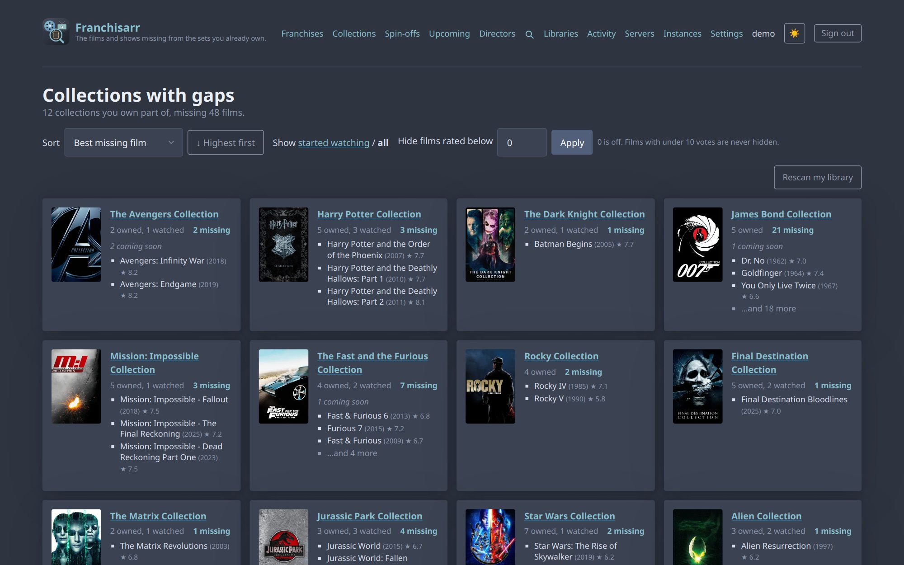
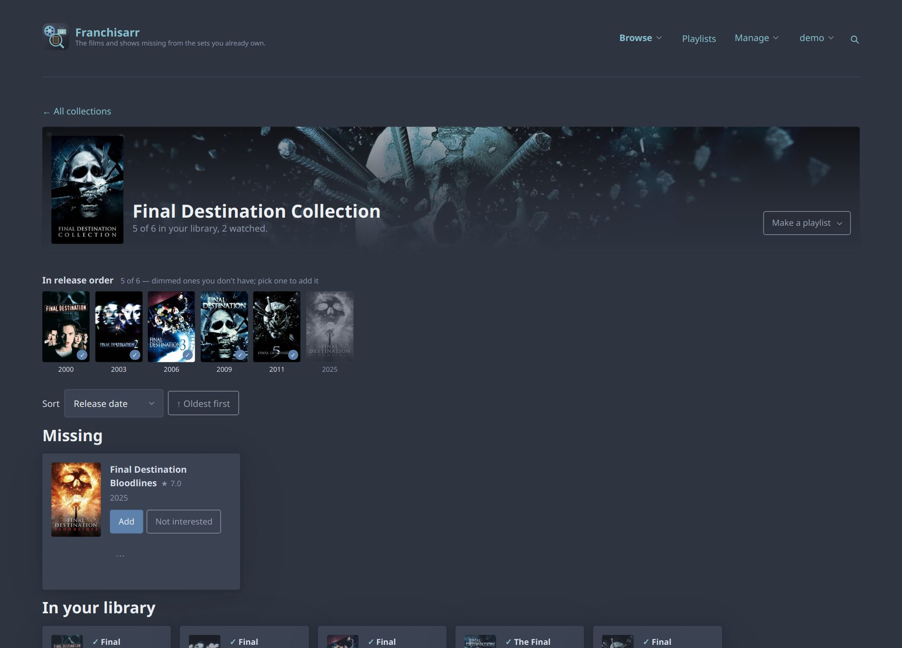
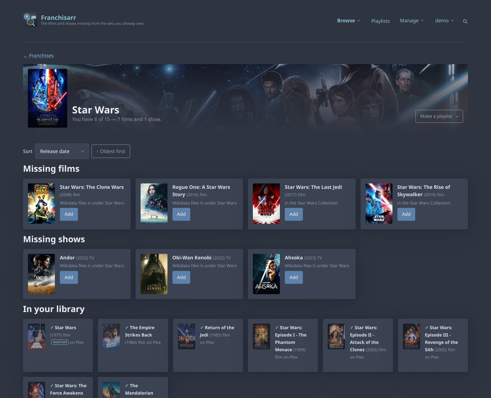
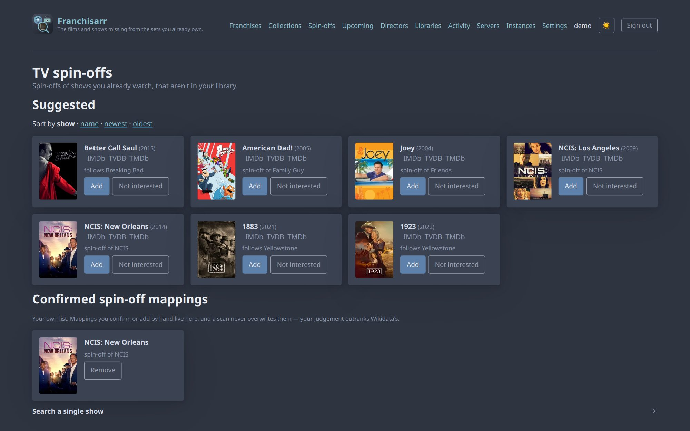
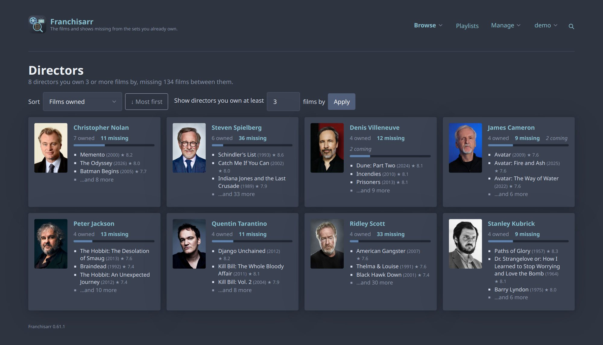
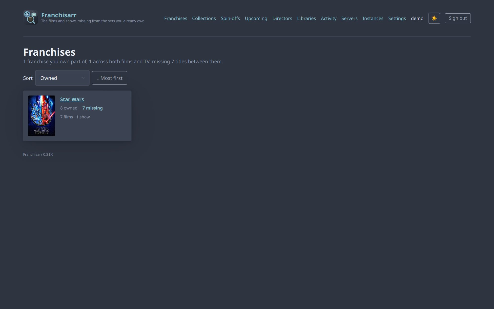
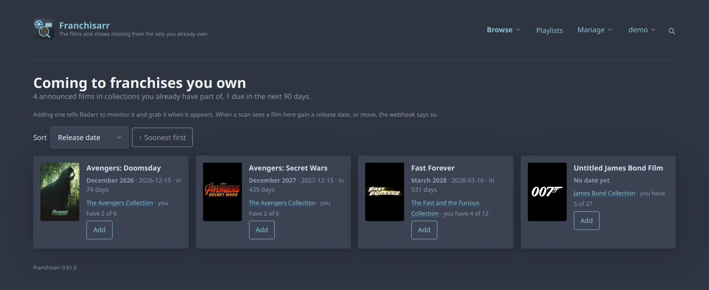
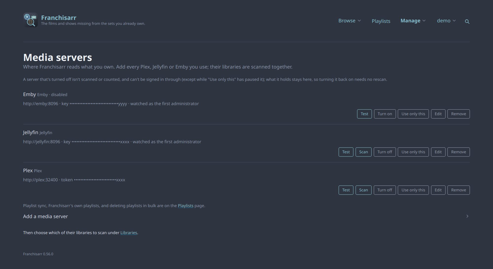
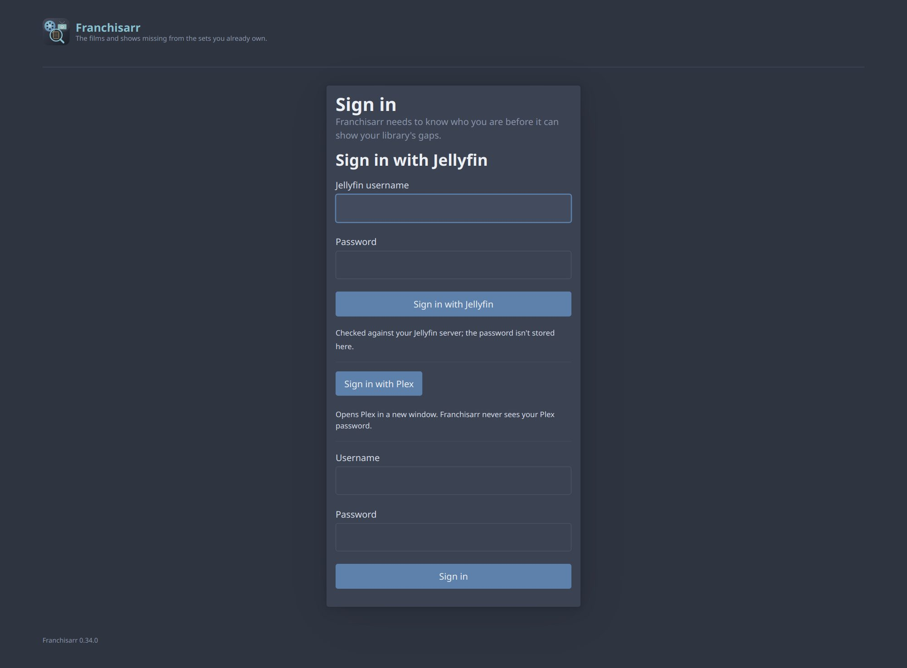

<p align="center"></p>

# Franchisarr

Franchisarr looks at your **Plex, Jellyfin or Emby** library and finds two things you probably
want and don't have:

- **Films missing from collections you already own part of.** You have *Beverly Hills Cop* and
  *II* but not *III* — one click sends it to Radarr.
- **Spin-offs of shows you already watch.** You have *NCIS* but not *NCIS: Los Angeles* — one
  click sends it to Sonarr. Found through Wikidata, so it also knows *Family Guy* → *American
  Dad!*, which no name search could — and crosses between film and TV: own the film *Serenity*
  and it suggests the series *Firefly*.

Every list can be sorted — pick what to sort by from the dropdown, and flip the direction with the
button beside it ("↓ Most first", "A → Z") — and each page remembers your last choice on your
account, so it follows you between devices.

And, built on the same data: **franchise pages** that put films and TV together (*Star Wars —
you have 8 of 15*; fan films are left out), **director pages** (*you own 11 Nolan films; missing* Following *and*
Insomnia), an **Upcoming** page of announced films in franchises you own — as a list or a month-by-month
calendar — with release-date notifications, **import lists** Radarr and Sonarr can poll so you never have to click Add, and
**playlists** of a franchise, collection or director in release order, on Plex, Jellyfin or Emby — films and episodes
together, so a franchise plays the way it came out.

It reads all three — one of them or several at once, with a film on any of them counting as
owned and a tick on what you've watched — supports multiple Radarr and Sonarr instances, signs
you in with your media-server account, scans on a schedule,
tells you when it finds something new — Discord, Slack, or anything
[Apprise](https://github.com/caronc/apprise) reaches (Telegram, Pushover, ntfy, email, a hundred
more) — wears your
[theme.park](https://theme-park.dev) theme like the rest of your stack, and has a web UI and a
CLI. Everything
it hides — low-rated films, TV specials, shorts, directors' music-video collections — is folded
away rather than deleted, and most of it is a preference.

Franchisarr owes its starting idea to [Gaps](https://github.com/JasonHHouse/gaps), which has
found missing collection films in Plex since 2019. This is that idea extended to Jellyfin and
Emby, to TV spin-offs and cross-media franchises, and to import lists the *arrs poll themselves.

**Status:** pre-1.0 and in daily use against a real library of ~3,400 films and ~660 shows.
Images are published to GHCR for amd64 and arm64.

**How it was built:** largely written by Claude Code, Anthropic's AI coding tool — directed,
tested against a real library and reviewed by a human. The core — matching, gaps, spin-offs,
franchises, directors — was measured against that library as it was built (the numbers are in
the [changelog](CHANGELOG.md)); what hasn't been tested for real is listed under
[What's been tested](#whats-been-tested-and-on-what). There are over 1,100 tests with no live
network calls, and the full git history was scanned for secrets before the repo went public. The code is
MIT; read it.

## What it looks like

<p align="center"></p>

| Collection detail | Franchise |
|---|---|
|  |  |

| TV spin-offs | Directors |
|---|---|
|  |  |

<details>
<summary>More: franchises, upcoming, media servers, sign-in</summary>






</details>

## Quick start

```bash
mkdir franchisarr && cd franchisarr
curl -fsSLO https://raw.githubusercontent.com/prophetizer/franchisarr/master/docker-compose.yml
curl -fsSL https://raw.githubusercontent.com/prophetizer/franchisarr/master/.env.example -o .env
# edit .env — at minimum: your media server (PLEX_URL+PLEX_TOKEN, or JELLYFIN_URL+JELLYFIN_API_KEY,
#   or EMBY_URL+EMBY_API_KEY), TMDB_API_KEY, ADMIN_USERNAME, ADMIN_PASSWORD
docker compose up -d
```

The image is `ghcr.io/prophetizer/franchisarr` (`latest`, or a version like `0.71.1`). To build
from source instead, clone the repository and change `image:` to `build: .` in the compose file.

Then open <http://localhost:8000>, sign in, choose which libraries to scan, and run a scan.

You need a **TMDb API key** — the free v3 one from
[themoviedb.org/settings/api](https://www.themoviedb.org/settings/api). Note it's the *shorter*
value on that page; the v4 Read Access Token won't work, and Franchisarr will tell you so if you
paste it by mistake.

### Unraid

**Coming, after more testing.** A Community Applications template is drafted in
[`contrib/unraid/`](contrib/unraid/), but it hasn't been run on Unraid yet, so it isn't
recommended. Until then it runs on Unraid like any other container: image
`ghcr.io/prophetizer/franchisarr`, port 8000, a path mapped to `/config`, and the environment
variables from the Configuration table below.

## Configuration

Almost everything can be set in the app itself — media servers under **Servers**, Radarr,
Sonarr and Seerr under **Instances**, the rest under **Settings**. Environment variables are a
convenience for docker-compose, and they behave in one of two ways:

- **Seeded once:** media servers, Radarr, Sonarr, the admin account, and the values Settings
  owns (TMDb and fanart.tv keys, schedule, notifications). Read on first boot only; after that
  the database wins, so change them in the app. The exception is `TMDB_API_KEY`: while no key
  is saved it's read at every start, so adding it to `.env` later and restarting works. The log
  names any other `.env` value that's being ignored.
- **Read every start:** `BASE_URL`, `TZ`, `PUID`/`PGID`, `LOG_LEVEL`, `SESSION_COOKIE_SECURE`, `TRUSTED_PROXY_HOPS`,
  `SHOW_ARTWORK`, the `TP_*` theme variables and `UPDATE_CHECK`. Change these and restart.

See [`.env.example`](.env.example) for the full list.

| Variable | Purpose |
|---|---|
| `PLEX_URL`, `PLEX_TOKEN` | Your Plex server |
| `JELLYFIN_URL`, `JELLYFIN_API_KEY` | Your Jellyfin server (Dashboard → API Keys) |
| `EMBY_URL`, `EMBY_API_KEY` | Your Emby server |
| `MEDIA_SERVER` | Optional: seed only `plex`, `jellyfin` or `emby` when several pairs are set |
| `TMDB_API_KEY` | Your own free v3 key |
| `FANART_API_KEY` | Optional; adds franchise logos to collection headings |
| `SHOW_ARTWORK` | `false` turns off all poster and logo images |
| `RADARR_URL`, `RADARR_API_KEY` | Optional first Radarr; more can be added in the UI |
| `SONARR_URL`, `SONARR_API_KEY` | Optional first Sonarr |
| `ADMIN_USERNAME`, `ADMIN_PASSWORD` | Fallback login, created on first boot only |
| `BASE_URL` | e.g. `/franchisarr` when behind a reverse proxy subpath |
| `SCAN_SCHEDULE_CRON` | e.g. `0 3 * * *`; empty disables scheduled scans |
| `TZ` | Which timezone the schedule runs in |
| `PUID`, `PGID` | Ownership of the config volume, as in the linuxserver.io images |
| `TRUSTED_PROXY_HOPS` | Reverse proxies in front of the app (default 1; 2 behind Cloudflare's proxy plus Traefik). Lets the sign-in rate limit see visitors' real addresses |

### Spin-offs

Spin-offs of shows you own are discovered from [Wikidata](https://www.wikidata.org) during a
scan — no key or account needed — and matched on TMDb ids rather than titles, so it finds the
ones whose names give nothing away (*Family Guy* → *American Dad!*). Weaker evidence is marked
*possible*, and nothing is ever added without you clicking.

### Import lists for Radarr and Sonarr

Rather than clicking Add per film, let the *arrs pull from Franchisarr. Under **Settings →
Import lists**, generate a key (Settings is for administrators); then in Radarr, *Settings → Import Lists → Add → Custom List*
and paste a films URL, for example:

```
https://franchisarr.example.com/api/lists/films.json?api_key=YOUR_KEY&min_rating=7
```

Sonarr takes the `shows` URL the same way. The key is shown once, stored only as a hash, and can be
revoked from the same place. Radarr's and Sonarr's own settings then decide what
to monitor and where — Franchisarr never adds anything itself. Your dismissals and preferences apply to the
lists; `min_rating` on the URL overrides the household floor for that list only.

### Artwork

Collection screens show posters from TMDb. Adding a free
[fanart.tv key](https://fanart.tv/get-an-api-key/) additionally puts the franchise wordmark over
a backdrop at the top of each collection — the only thing that key is used for.

Both are fetched by the browser from `image.tmdb.org` and `assets.fanart.tv`, so a client with no
internet access, or anyone who would rather nothing left their network, can set
`SHOW_ARTWORK=false` for a text-only interface.

### Connecting to Radarr and Sonarr

Use their address on your own network, not a public one:

```yaml
services:
  franchisarr:
    networks: [arrs]          # the network Radarr and Sonarr are already on
networks:
  arrs:
    external: true
```

```
RADARR_URL=http://radarr:7878
SONARR_URL=http://sonarr:8989
```

A public URL behind a login proxy — Authelia, Authentik, Cloudflare Access — will **not** work:
those answer API requests with a login page, and an API key can't get past one. Franchisarr says
so rather than blaming your API key. If you'd rather keep the public URL, add a bypass rule in
the proxy for `/api` so API-key requests are let through.

## Seerr

If your household routes requests through [Seerr](https://github.com/seerr-team/seerr) — or the
Overseerr or Jellyseerr it grew out of — add it on the Instances page, with the API key from
Seerr's own Settings → General. Every Add dialog then offers **Request via Seerr** next to the direct Radarr/Sonarr
choice: Seerr picks the *arr, profile and folder from its own settings, and the request shows up
in Seerr's history like any other. Open requests keep a title out of the lists the way a queued
Radarr add does; declined and failed ones come back, since those are worth asking again.

One thing to know: Seerr's API key acts as its **administrator**, and administrators' requests
are approved automatically. So a request made from Franchisarr normally goes straight through
rather than waiting for someone to approve it — the result in the dialog says which happened.

In February 2026 the Overseerr and Jellyseerr teams
[merged into Seerr](https://docs.seerr.dev/blog/seerr-release) — one codebase with both
projects' features — and Overseerr's own repository was archived. All three speak the same
`/api/v1`, so an older instance keeps working: pick which one you run when you add it, and only
the label changes.

## Getting around

The top bar has its menus: **Browse** (Franchises, Collections, Spin-offs, Upcoming,
Directors, Trophy case); for administrators **Playlists** (one page with tabs) and
**Manage** (Servers, Libraries, Instances, Users, Settings, Activity); and one under your name (Preferences, Password, light/dark, Sign out), with
search at the far right. The menu holding the page you're on is highlighted. On a phone it's a
single ☰ button.

The home page leads with rows of posters: the collections you're **closest to completing**,
films in franchises you own **coming in the next 90 days**, and titles **just added** to your
library from sets you're collecting (counted from 0.45.0 on — nobody recorded when earlier ones
arrived). The summary cards for each section sit below them.

**Showcase look.** Under your name, **✦ Showcase look** switches you (and only you — it's saved to
your account) from the everyday Classic look to a flashier one: franchise and collection banners
go full-width with a slow zoom and parallax, the page takes on the colour of its artwork, headline
numbers count up, and posters and cards tilt toward the pointer. The top bar stays pinned, frosted
glass over the page; posters sharpen in as they load; a thin glow runs along the top while a
button's request works; and on a collection, franchise or director page the films you don't have
sit as dimmed, outlined gaps on the shelf. The home page opens on a big rotating **spotlight** of
the collections you're nearly done with, which shrinks to a strip as you scroll, and its poster
rows slide along with arrows. List cards show a completeness ring, and a light runs round any
set one film from done; pausing on a collection or franchise card previews its backdrop and the
films it's missing. Click a missing film's poster (or rest the pointer on it) and the card turns
over to its plot, genres and score. The page's artwork lights the whole page, blurred, behind
everything; your own posters drift in a wall behind the home page's heading; banners open like a
film's title card; cards glide in as you scroll and
the rest dim around the one you point at; a complete collection's poster and every trophy get a
holographic foil; a running scan shows its progress in the browser tab; banners get darkened
corners and their name in huge outlined type behind them; the release strip becomes a strip of film;
headline numbers roll like an odometer; a slim bar keeps a detail page's name in view as you
scroll; pointing at a collection card fans its films out; a new Trophy case badge unlocks with a
flourish; a set that's mostly one genre has its banner's picture graded to suit (sepia for
westerns, grey for crime, a flicker for horror); a collection or franchise
page ends with its **end credits** rolling up — each title, its year and who directed it — to *The
End*, or *To be continued…* while titles are missing; adding a film prints you a ticket stub;
**📚 Shelf** shows Collections or Franchises as box sets on a shelf; clicking an owned film's
poster (or the page's own) opens it large; a projector beam shines across the home spotlight;
empty and finished pages get a little scene; a set's poster is black and white with colour risen
up it as far as you own, and a detail page's poster stands as a 3D box set; coming-soon films
count down their days on a split-flap board; a watched film's poster has its ticket punched; TV
shows sit in old CRT screens; a trailer dims the house lights; a running scan plays on a
projector; Activity's adds are a roll of ticket stubs; posters blur up from a tiny copy instead of
popping in; a collection's, franchise's or director's banner shows the set as **cinema seats**, one lit
for each film you own, and the page takes its art's colour for its links and buttons; and a hundred and twenty-eight franchises open with a nod to their films ([listed
below](#franchise-intros)) (and there's a code for a retro VHS mode, if you know it); **Ctrl+K** (Cmd+K on a Mac) searches from anywhere; and in October horror sets glow
pumpkin, in December the top bar frosts over. The release strip
**plays** as it comes on screen (posters fly in in order, the ones you own light up, a ring fills
to how much you have); and a poster you click **grows into the page** it opens (in browsers with
view transitions: Chrome, Edge, Safari). Phones get the calmer half (no parallax, tilt, arrows,
previews or ambient light, and a shorter spotlight that stays put), and your device's "reduce
motion" setting turns the motion off. **✨ Effects** in the menu under your name is your own dial:
*full*, *calm* (every look kept, but nothing loops or flashes) or *off* (no motion at all, as
reduce motion). **◻ Classic look** switches back.

In both looks, a director's page has their photo softened behind the banner and their career as a
strip in release order, marked by decade, and a long list sorted by release date gets a slim
heading where each decade starts.

When a scan finds you've completed a collection — every released film of it in your library —
Showcase throws **confetti** with a "Collection complete!" message, once for each person, on
their next visit to the home page or that collection. (Collections already complete when you
first upgrade aren't news, and don't count.) While a scan runs, a film reel turns and the progress
bar runs like film.

**🎲 Surprise me** on the home page (and at the top of Showcase's Ctrl+K box) picks a film you're
missing at random — one rated 6.5 or more on TMDb by at least 50 people, from your collections
and directors' lists, and not one you've dismissed — with its plot, where it's from, an Add button
and **Spin again**. Showcase spins through posters like a slot machine before it lands.

**▶ Trailers**, in either look: a missing film's tile (collection, franchise and director pages),
the Surprise me card, the back of a turned-over poster and the Showcase spotlight each have a play
button, which opens the trailer TMDb lists in a pop-up. It plays in YouTube's privacy-enhanced
player (youtube-nocookie.com); nothing from YouTube loads until someone presses play, and then
YouTube sees your Franchisarr's address (the origin only — its player won't play without it).

Each franchise page has a **Map** of how the franchise fits together — its collections, its other
films and its shows, with which show spun off which — in three shapes: **Lanes** (a
timeline lane per series), **Tree** (the franchise, its series, their titles) and
**Constellation** (a web you can drag about). Your pick is remembered; owned titles are filled in,
missing ones hollow, and each leads to its collection page.

The **Trophy case** (Browse → Trophy case, in either look) shelves everything your library has
finished — every collection, franchise and director's filmography with each released film in it
— newest first, with milestone badges (first complete collection, 10, 25, 50…) and how far off the
next one is. Showcase frames them in gold.

Franchise and collection pages open with the whole set **in release order** — a strip of
posters, the ones you have in colour and the ones you don't dimmed, so the holes in the run show
at a glance. Pick a dimmed one to add it; the lists below have everything else.

### Franchise intros

In the Showcase look, these franchises' collection and franchise pages open with a nod to their
films — in this app's own words and drawing, with no logos, music or lines from the films. Each
plays once per visit to a page; a click or any key skips it, **▶ Intro** on the page plays it
again, **🎬 Franchise intros** in the menu under your name turns them off for you, and your
device's "reduce motion" setting turns them off altogether. Completing one of these franchises
also brings its own confetti. A small gold clapperboard on a card — in the Collections and Franchises
lists (and on the shelf), the home page's rows and spotlight, the Trophy case, search and Ctrl+K
— marks a set whose page has one; it isn't shown to anyone who has intros switched off.

Every other collection and franchise gets a shorter **genre intro** (about two and a half seconds),
built from its own name, counts and poster: a 3-2-1 countdown leader for most, and for a set that's
mostly one genre, flickering red for horror, hyperspace for sci-fi, bouncing colour for animation,
a wanted poster for westerns, searchlights for war, swirling sparkles for fantasy, or rain and
venetian blinds for crime. Only the franchises below carry the gold clapperboard on their cards.

| Franchise | Plays on pages named | What happens |
|---|---|---|
| Star Wars | *Star Wars* | "A short while ago, in a library not so far away…", then a crawl about your collection — how many films you have and the rest still at large — receding into the stars |
| The Matrix | *Matrix* | Falling green code |
| Harry Potter | *Harry Potter*, *Wizarding World*, *Fantastic Beasts* | Gold sparks thrown from the title, as from a wand (the page stays usable) |
| Marvel Cinematic Universe | *Marvel Cinematic Universe*, *The Avengers Collection*, *Iron Man Collection*, *Thor Collection*, *Captain America Collection*, *Spider-Man (MCU)…*, *Guardians of the Galaxy Collection*, *Captain Marvel Collection* and the other MCU solo series | Your own posters flick past like comic pages, faster and faster, then a red flash |
| James Bond | *James Bond* | Dots across a black screen, a gun barrel opening onto the page, a red wash, then the circle widens |
| Star Trek | *Star Trek* | Stars stretch into streaks, the jump to warp, a white flash |
| Jurassic Park | *Jurassic Park*, *Jurassic World* | A glass of water ripples with each distant thud, and the page shakes (the page stays usable) |
| Back to the Future | *Back to the Future* | A time-circuit display — latest film, today, first film — then twin fire trails |
| Mission: Impossible | *Mission: Impossible* | A burning fuse and a briefing about your missing films, which then self-destructs |
| Alien | *Alien…*, *Prometheus…*, *AVP…* | A motion tracker, one contact for each missing film, closing in |
| Batman | *Batman*, *Dark Knight* | A searchlight sweeps the clouds and settles into a bat signal |
| Jaws | *Jaws* | The page under water, a fin cutting slowly across, then the water drains away |
| Terminator | *Terminator* | A red targeting display frames the poster and lists your missing films as targets |
| Indiana Jones | *Indiana Jones* | An old map, a red route travelling through the films in release order |
| Middle-earth | *Lord of the Rings*, *Hobbit*, *Middle-earth* | A gold ring turning in the dark, glowing hotter, then flaring |
| Ghostbusters | *Ghostbusters* | Green slime runs down the screen in uneven drips, then slides away |
| Godzilla | *Godzilla*, *MonsterVerse* | Footsteps shake the page, dust falls, a vast shadow passes and a blue glow rises (the page stays usable) |
| Mad Max | *Mad Max*, *Furiosa* | A sandstorm tears across the screen, then blows itself out (the page stays usable) |
| Toy Story | *Toy Story* | A blue sky of fluffy clouds, which part to let the page through |
| Fast & Furious | *Fast and the Furious*, *Fast & Furious*, *Hobbs & Shaw* | A speedometer swings into the red, a blue flash, then the page tears past in streaks and tyre smoke |
| Rocky | *Rocky…*, *Creed…* | A bell, then a run up a long flight of steps at dawn — a step for each film — to arms raised at the top |
| Die Hard | *Die Hard…* | A tower block's windows light up floor by floor, then glass bursts out across the screen |
| Transformers | *Transformers*, *Bumblebee…* | The poster in mechanical panels, flung apart, that slide, turn and lock back together |
| Scream | *Scream…* | A phone rings in the dark — caller unknown — with a question about your missing films, then a slash cuts the dark in two |
| Paranormal Activity | *Paranormal Activity* | The page as night-vision footage with a running timestamp; it flickers and the frame jolts (the page stays usable) |
| Final Destination | *Final Destination* | A chain reaction of dominoes, one per film, until the last brings the curtain down |
| Predator | *Predator* | The page in heat colours, a shimmering outline crossing it, three red dots settling on the title (the page stays usable) |
| Dragon Ball Z | *Dragon Ball* | An aura builds round the title, crackling, the page shakes harder, then a blast of light (the page stays usable) |
| X-Men | *X-Men*, *Wolverine…*, *The Wolverine…* | A dome of light scans a crowd of points and locks on to one for each film you own, then flashes outward |
| Pirates of the Caribbean | *Pirates of the Caribbean* | A compass needle spins and settles, the sea rolls in, and the waves part to let the page through |
| Resident Evil | *Resident Evil* | A red laser grid sweeps down a dark corridor, then a containment report lists your missing films |
| Bourne | *Bourne* | A surveillance map: a dot hops from city to city, one per film, with readouts, until the signal is lost |
| Ice Age | *Ice Age…* | Frost creeps in from the edges and freezes the screen, then cracks and falls away (the page stays usable) |
| Twilight | *Twilight Collection*, *The Twilight Saga* | A misty blue-grey forest; a shaft of sunlight breaks through and the title sparkles |
| Shrek | *Shrek*, *Puss in Boots* | A storybook opens on your collection's tale; a page turns, then one is torn out |
| Halloween | *Halloween…* | A carved pumpkin flickers in the dark, its candle guttering, until it blows out |
| The Conjuring | *Conjuring*, *Annabelle…* | An instant photo slides in and develops into your poster — with a shadow in it that wasn't there before |
| The Exorcist | *Exorcist* | A foggy street at night, a lone figure under a streetlamp, the light flickering as the fog rolls in |
| The Purge | *The Purge…* | An emergency broadcast: alert bars, a notice about your missing films, a ticker and a red siren sweep |
| John Wick | *John Wick* | Neon rain on a dark street, and a gold coin spinning down to land on the title |
| Bad Boys | *Bad Boys…* | The title turns a slow full circle against a hot sunset and palm trees |
| Rambo | *Rambo*, *First Blood…* | Dense jungle fills the screen, rustling, then is slashed apart |
| Starship Troopers | *Starship Troopers* | An old newsreel: a service bulletin tallying your films, and a swarm massing on the horizon |
| Home Alone | *Home Alone* | A snowy house at night with its lights on, and a paint can on a rope swinging down across the screen |
| Kung Fu Panda | *Kung Fu Panda* | Ink brush strokes on rice paper paint the title, with peach blossom drifting |
| Jumanji | *Jumanji* | Two dice roll across a board — landing on the number still missing — then jungle vines cover the screen |
| Avatar | *Avatar Collection* | A dark forest lights up in blue and violet, ripple by ripple, with drifting seeds of light |
| The Hunger Games | *Hunger Games* | An arena countdown, a cannon for each missing film, and three lights rising across the sky |
| The Mummy | *The Mummy…* | Sand blows across a wall of carved symbols, gathers into a great face and crumbles away |
| Superman | *Superman*, *Man of Steel* | Clouds rush past as if climbing; a red-and-blue streak shoots up through them, and a flash |
| Sharknado | *Sharknado* | A tornado spins up, sharks whirling round in it, then tears off sideways |
| The Ring | *The Ring…* | Static, a stone well in a dark clearing, static again, and the set switches off to a line |
| 28 Days Later | *28 Days…*, *28 Weeks…*, *28 Years…* | A red spread across an empty city map, a stage per film, as the days count up |
| Blair Witch | *Blair Witch* | Shaky torchlight in dark woods, twig figures hanging from the branches, and the camera drops |
| Deadpool | *Deadpool* | Comic captions that know they're in an intro and comment on your collection, then two slashes |
| Blade | *Blade…* (but not Blade Runner) | A red strobe in the dark, then a silver blade arcs across and the page appears in its wake |
| RoboCop | *RoboCop* | A robotic display boots, states three directives about your library, and scans the title |
| Kingsman | *Kingsman* | A black umbrella spins open to fill the screen, then snaps shut on the page (the page stays usable) |
| Men in Black | *Men in Black* | Dark glasses slide down, then a flash — and you never saw how many films are missing |
| TRON | *TRON* | Light trails race across a neon grid, turning square corners, then the grid flies off |
| The Godfather | *Godfather* | A dim, sepia room with smoke under one lamp; the title fades up in an elegant hand and dissolves |
| Planet of the Apes | *Planet of the Apes* | A red sunset over overgrown ruins, and an ape's silhouette with a spear rising on the skyline |
| How to Train Your Dragon | *How to Train Your Dragon* | A dragon silhouette swoops past through dusk clouds, wings beating, and banks away |
| Cars | *Cars…* | Racing stripes zoom past, then a checkered flag waves and sweeps the page in |
| Night at the Museum | *Night at the Museum* | A dark hall, the lights flicker on, and a dinosaur skeleton turns its head to look at you |
| The Chronicles of Narnia | *Narnia* | Wardrobe doors open on snowy woods, a lamp-post glowing in the snow |
| Insidious | *Insidious* | Pitch dark; a red door glows at the far end, creaks open, and something breathes out of it |
| The Shining | *The Shining…*, *Doctor Sleep…* | A long hotel corridor with a bold patterned carpet rushes past, down to a door at the end |
| The Thing | *The Thing…* | An Antarctic blizzard at night, a lone outpost light blinking, the snow thickening to white-out |
| Underworld | *Underworld…* | Blue moonlit rain over gothic rooftops, the full moon behind cloud, lightning |
| Top Gun | *Top Gun* | Jets streak across a sunset trailing contrails, a flare of sun as they bank away |
| Ocean's | *Ocean's…* | A vault dial spins to a combination — what you have, how many there are, how many are missing — and the door swings open |
| The Equalizer | *Equalizer* | A stopwatch races while the room blurs past, then stops with a click |
| Lethal Weapon | *Lethal Weapon* | Red and blue lights sweep a dark street strung with Christmas lights |
| 2001: A Space Odyssey | *Space Odyssey*, *2001…* | A black monolith, and a sunrise climbing over a planet's edge into alignment above it |
| Venom | *Venom…* | Glossy black tendrils creep in from the edges, writhing, then snap back (the page stays usable) |
| Wonder Woman | *Wonder Woman* | A golden lasso spins and widens into a ring of light that sweeps the screen |
| Spider-Man | *Spider-Man…*, *The Amazing Spider-Man…*, *Spider-Verse* (the MCU's Spider-Man plays the MCU intro) | A line of web shoots in from a corner, a web spreads from the middle, and the title is caught in it |
| The Lion King | *Lion King* | A savanna sunrise: a huge orange sun, acacia trees, and herds crossing the horizon |
| Wreck-It Ralph | *Wreck-It Ralph* | The poster breaks into chunky 8-bit pixels that crumble away, then fly back and rebuild |
| The Incredibles | *Incredibles* | Retro sixties title cards: bold colour blocks slide in and out, then the title |
| Despicable Me | *Despicable Me*, *Minions…* | A shrink ray zaps the page down to nothing, then it pops back (the page stays usable) |
| Beverly Hills Cop | *Beverly Hills Cop* | A sunny palm-lined boulevard rushing past, police lights flashing behind |
| Kill Bill | *Kill Bill* | A stark yellow screen with the title in black; a katana stroke slices it in two and the halves slide apart |
| Taken | *Taken…* | A city map zooming in, a pin dropping for each missing film, labelled |
| The Expendables | *Expendables* | A wall of fire, and a row of silhouettes walking out of it toward you, one per film you own |
| Austin Powers | *Austin Powers* | A psychedelic sixties swirl, bands of colour and flowers spinning out from the middle |
| The Mask | *The Mask Collection*, *Son of the Mask* (not The Mask of Zorro) | A green whirlwind spins across the screen and stops dead with a cartoon pop (the page stays usable) |
| Zombieland | *Zombieland* | Survival rules stamped on screen one at a time, in your library's own terms |
| Hotel Transylvania | *Hotel Transylvania* | Bats swirling round a spooky castle hotel at night, its windows lighting up one by one |
| Tomb Raider | *Tomb Raider* | A torch-lit tomb floor whose stone tiles crack and fall away, leaving the page beneath |
| Pacific Rim | *Pacific Rim* | Rain over a dark sea; a giant robot's silhouette rises, and its chest lights up |
| National Treasure | *National Treasure* | An old map warms, and hidden writing appears on it: your missing films, as clues |
| Sherlock Holmes | *Sherlock Holmes* | A magnifying glass sweeps a foggy gaslit street, noting clues about your collection |
| Knives Out | *Knives Out*, *Glass Onion*, *Wake Up Dead Man* | A sunburst ring of knives turns slowly; one is drawn out and the ring falls apart |
| Teenage Mutant Ninja Turtles | *Ninja Turtles* | Sewer pipes, and four coloured masks flashing past one after another |
| Sonic the Hedgehog | *Sonic the Hedgehog* | A blue streak loops around the screen collecting gold rings, then zooms off |
| It | *It Collection*, *It Chapter…* | Rain on a dark street, and a single red balloon floating up out of a storm drain |
| Evil Dead | *Evil Dead* | The camera rushes low and fast through dark woods to a lone cabin, whose door bursts open |
| Beetlejuice | *Beetlejuice* | Black-and-white stripes swirl into a spiral, a little model town spinning in the middle |
| Hocus Pocus | *Hocus Pocus* | A black-flame candle lights, green fog rolls, and three witches on brooms cross a full moon |
| Dune | *Dune…* | Golden dunes shimmering in the heat, and a vast ripple travelling under the sand toward you |
| Blade Runner | *Blade Runner* | A neon city in the rain at night, flying cars drifting past glowing towers |
| Hellboy | *Hellboy* | Red flames lick up the edges, then a great stone fist punches in and the screen cracks |
| Gladiator | *Gladiator…* | A hand brushing through golden wheat at sunset, then arena gates grinding open |
| Frozen | *Frozen…* | Ice crystals spread from the centre into a great snowflake, then shatter into sparkles |
| Finding Nemo | *Finding Nemo*, *Finding Dory* | Underwater: rays of light, bubbles, coral, and a small orange fish darting across |
| Monsters, Inc. | *Monsters, Inc.*, *Monsters University* | Doors whizz past on a factory rail; one stops, opens, and light spills out |
| Inside Out | *Inside Out* | Glowing memory orbs in five colours roll in and line up, one per film (dimmer for the ones you're missing) |
| The Hangover | *The Hangover…* | Morning-after camera flashes: blurry snapshots, ending on your collection's poster |
| Scooby-Doo | *Scooby-Doo* | A groovy flower-painted van drives across, then a sheet ghost is unmasked |
| Joker | *Joker…* | A playing card spins in purple and green light and lands face up on the joker |
| A Nightmare on Elm Street | *Elm Street* | A hot red boiler room hissing steam, then four claw marks slash across the screen |
| Saw | *Saw…* | A flickering bulb over grimy tiles, a jigsaw-piece timer counting down, then the light dies |
| Psycho | *Psycho…* | In black and white, a shower curtain is torn aside, its rings snapping, and the water spirals down the drain |
| World War Z | *World War Z* | A swarm of figures pours up and over a high wall like a wave |
| 300 | *300…* | A sepia sky over a wall of shields, then a volley of arrows that blots out the sun |
| The Karate Kid | *Karate Kid*, *Cobra Kai* | A silhouette balancing in a crane stance on a post by the sea at sunset |
| The Meg | *The Meg…*, *Meg…* | A tiny boat on calm water, and a colossal shark's shadow gliding underneath |
| Mortal Kombat | *Mortal Kombat* | Fire from one side, ice from the other; they meet in the middle in a flash |
| Airplane! | *Airplane…* | A propeller plane bobbing through clouds as a "fasten seat belts" sign flickers |
| Ace Ventura | *Ace Ventura* | A parade of jungle animal silhouettes trotting across a tropical sunset |
| Anchorman | *Anchorman* | A seventies TV news card — "Breaking news" — with your collection as the headline |
| Spaceballs | *Spaceballs* | A ridiculously long spaceship takes forever to scroll past overhead |
| The NeverEnding Story | *NeverEnding Story* | An old book glows and its pages fly out, swirling into a vortex |
| The Polar Express | *Polar Express* | A steam train's headlight cutting through falling snow, steam billowing |
| Moana | *Moana…* | Ocean waves rise into a towering wall of sparkling water, which then parts |
| Paddington | *Paddington* | A little suitcase and hat, and a luggage label tied on with a note about your collection |

## Search

The magnifying glass at the right of the top bar (or pressing **/**) opens a search over everything Franchisarr knows: the
collections and franchises you own part of, directors with a page, and every film and show it
has come across — in your library, in a collection, a franchise, a director's filmography or a
spin-off list. Results appear as you type and are grouped by kind. Each film or show says
whether you have it (and on which server), whether Radarr or Sonarr already has it, or whether
it's missing or not out yet, and links to the pages it belongs to; missing ones have **Add** and
**Not interested**. Case, accents and punctuation don't matter: *spiderman* finds *Spider-Man*
and *amelie* finds *Amélie*. It searches what's already here, not all of TMDb.

## Playlists

Franchise, collection and director pages have a **Make a playlist** button in their banner
(administrators only). It builds a playlist of everything you own on that page, on each of your Plex, Jellyfin
and Emby servers that holds some of it, in the order it was released: films by release date,
and for a franchise that spans film and TV, every episode placed by its air date — so *Agents of
S.H.I.E.L.D.* falls between the Marvel films as it was broadcast. Specials (season 0) are left
out. With more than one server the button opens a menu — **On every server**, or **On Plex**,
**On Jellyfin** and so on for just one. Once Franchisarr is keeping one, the banner says where
("✓ Playlist kept on Plex, Jellyfin") and the button reads **Refresh playlist**.

- It's called "*name* (Franchisarr)" and gets its own square poster: the franchise or
  collection backdrop across the top, and the name, "In release order" and what's in it ("13
  films · 3 shows · 279 episodes") on a dark panel below (a director gets their film posters
  instead). Playlists with any other name are never touched.
- **It's kept current.** After every scan (and at every sync), titles you've added since go in
  where they belong and ones you've removed come out. The playlist is edited in place, so it
  keeps its poster and its spot in your apps. Delete it on any server and Franchisarr deletes it
  on the others too and stops keeping it. A server that's off or can't be reached is never taken
  for a deletion.
- Playlists belong to one account. On Plex that's the account of the token Franchisarr uses —
  normally yours as the server owner. On Jellyfin and Emby it's the server's *watched as* user
  (Servers page), which is the first administrator unless you've set one.
- The order is release order. Nothing records story order (where *Rogue One* sits in the saga),
  so that isn't offered.

## The Playlists page

One page for administrators, with four tabs. At the top: how many playlists are syncing and
being kept, when the last run was and anything that couldn't be copied, **Sync now**, and when
syncs run — always after every scan and on **Sync now**, and optionally every hour, 6 hours,
12 hours, daily, or on a cron schedule of your own.

- **Your playlists** — keep your own playlists in step between servers, both ways (below).
- **Franchisarr's** — every playlist Franchisarr keeps, in collapsible Franchises / Collections /
  Directors groups with a thumbnail and a chip per server for what it holds there, and a
  **Remove** button (deletes it everywhere). **Put them on** chooses the servers they go on;
  unticking one deletes them there. **Add many at once** makes one for every franchise,
  collection and/or director you tick, on one server or all, in the background with progress
  and a Stop button; a set with fewer than two titles on a server is skipped there.
- **Clean up** — on one server or every server: **Delete Franchisarr's playlists** removes only
  playlists named "… (Franchisarr)" (and stops them going to that server); **Delete all
  playlists** removes every playlist in the account Franchisarr uses (on Plex the token's owner;
  on Jellyfin and Emby the *watched as* user), including ones made by hand, and needs **DELETE**
  typed. Jellyfin and Emby don't say who owns a playlist, so one shared with that account may be
  listed too. Both list exactly what would go before anything is deleted.
- **History** — the last 30 runs.

### Playlist sync

**Your playlists** is a checklist of the playlists on each server, one collapsible section per
server (closed to start: they can be long). A text filter and **All / Syncing / Not syncing /
Problems** chips narrow it, opening the sections with matches; each synced playlist shows a chip
per server (✓ Attic 18/20, ⚠ blocked) that opens to say more. Tick the ones to keep in step across
your servers; once anything has changed, a bar at the bottom of the screen counts the changes
and offers **Save and sync** or **Undo**. At the top,
**Copy to** sets which servers get copies — every other one by default, which also takes in
servers you add later; any playlist can have its own with **change**. **Tick new playlists
automatically** syncs playlists made later too; untick any one to leave it out. **Save and sync**
applies it straight away.

It works **both ways**. At each sync, a title added to the playlist on any server is added on
the others (after the title it followed there), and one removed from it on any server comes off
the others. A rename on any server renames the rest. The order follows the original.

- Titles are matched by TMDb id — a film by its own, an episode by its show plus season and
  episode number. One a server doesn't have is left out there, and the page lists what's missing
  and why — with **Add** for a film Radarr doesn't have yet, or a show Sonarr doesn't. A title a
  server can't hold is never read as removed there.
- A copy starts with the same name and, if the playlist has its own poster, the same poster.
- Deleting the original deletes its copies. Deleting a copy on its server stops copying there
  (that server is unticked for it); unticking a server deletes the copy there. Unticking a
  playlist stops syncing it and leaves its copies as ordinary playlists.
- A playlist of the same name that sync didn't make is never touched: that copy shows as
  blocked, with **Link them** to treat it as the copy — the two lists are merged, so titles from
  either end up in both.
- A Plex smart playlist follows its own rules, so it's copied as it stands, one way.
- It uses the same accounts as everything else here (the Plex token's owner, the Jellyfin/Emby
  *watched as* user). Music and photo playlists aren't synced, and Franchisarr's own are kept on
  their own tab. A sync that fails sends a notification, if you've set one up.

## Calendar

**▦ Calendar** on the Upcoming page lays the announced films out month by month, each poster on
its release day (☰ List switches back; the page remembers which you chose). The page is also an
iCalendar feed, so announced films in franchises you own appear in
your calendar app — one all-day event per film, with the collection and how much of it you have:

```
https://franchisarr.example.com/api/lists/upcoming.ics?api_key=YOUR_KEY
```

Apple Calendar: File → New Calendar Subscription. Google Calendar: Other calendars → From URL.
Same key as the import lists (Settings → Import lists), and the URL is shown there. It refreshes
daily; films with no date yet appear once TMDb gives them one.

## Notifications

After a scan that finds something new — scheduled or started by hand, never every run, and
never the very first scan, whose findings are the state of your library rather than news —
Franchisarr sends one message. Settings → Notifications takes a Discord or Slack webhook, a generic JSON webhook for
your own automation, or **Apprise URLs**, one per line (`tgram://…`, `pover://…`, `ntfy://…`,
`mailto://…`; the [Apprise wiki](https://github.com/caronc/apprise/wiki) lists every service),
delivered from inside the app. If you already run
[apprise-api](https://github.com/caronc/apprise-api), point it at that instead and keep the
destinations there. The URL is treated as a credential: redacted in logs and in the redacted
config export.

## Dashboard widget

`/api/lists/stats.json?api_key=…` returns the headline numbers as one flat document — collections
with gaps, missing films, spin-offs, upcoming films, incomplete franchises, directors, library
size, last scan — cached for a minute. For [Homepage](https://gethomepage.dev):

```yaml
- Franchisarr:
    icon: https://raw.githubusercontent.com/prophetizer/franchisarr/master/docs/brand/icon-512.png
    href: https://franchisarr.example.com
    widget:
      type: customapi
      url: https://franchisarr.example.com/api/lists/stats.json
      headers:
        X-Api-Key: your-key
      refreshInterval: 300000
      mappings:
        - field: missing_films
          label: Missing films
          format: number
        - field: collections_with_gaps
          label: Collections
          format: number
        - field: missing_spinoffs
          label: Spin-offs
          format: number
        - field: upcoming_films
          label: Upcoming
          format: number
```

The key is the one from Settings → Import lists; the header keeps it out of your dashboard's
URL list, but `?api_key=` works too for widgets that can't send headers.

## Signing in

**Sign in with your media server account.** For Plex that is the usual OAuth button, and
Franchisarr never sees your Plex password. By default only the account that **owns** your Plex
server gets in: a Plex account that doesn't own it is refused, and so is anyone it's merely shared
with (see below to let them in). For Jellyfin and Emby it is a
username and password, checked against the server itself. Who administers Franchisarr follows
from the server: with Plex it's the server's owner, with Jellyfin and Emby it's anyone who is an
administrator there — checked again every time they sign in, so handing the server over, or
demoting someone on Jellyfin, takes their admin rights here with it. The sign-in page has a
**Sign in with** dropdown listing each way in this install offers (Emby, Jellyfin, Plex, and the
local account if one is set up), shows only the one you pick, and remembers it in that browser.

**By default only administrators can sign in.** Being able to reach your Plex server is a much
wider group than the people who run your house, so friends and family you share it with are
refused. If you want them in, turn on **Settings → Who can sign in**. They can then browse the
lists and hide titles for themselves, but they can't add anything to Radarr, Sonarr or Seerr,
start scans, or change settings, and they don't see those controls. Turning it off again signs
them out and stops their API keys. **Settings → Users** lists everyone who has signed in, and can
sign someone out everywhere, revoke their API key or remove them.

The local admin account from `ADMIN_USERNAME`/`ADMIN_PASSWORD` is the fallback for when no server
is configured yet, or plex.tv is unreachable. It's created on **first boot only**, so changing those
variables later has no effect — if you forget the password:

```bash
docker exec -it franchisarr python scripts/reset_admin_password.py            # lists accounts
docker exec -it franchisarr python scripts/reset_admin_password.py admin      # prompts for a new one
```

If no sign-in button is offered, Franchisarr couldn't reach your server at startup — with Plex
it has to know which server it belongs to before it can check that an account is allowed in.
Press **Test** on the server under *Servers*, or check that server's address and key and
restart.

### Several servers

On first boot every filled-in pair in `.env` becomes a server; after that, add and change them
under **Servers** in the app (name, address, key; a *watched as* username for Jellyfin/Emby, since an API key belongs to
nobody). Their libraries are chosen together on the Libraries page and scanned in one pass. A
film on two servers is owned once; its tile on a collection page says which servers hold it. Watched films get a
tick, and the Collections page can be filtered to franchises you've actually started.

Each server on the Servers page has its own **Scan** button (just that server's libraries) and a
**Turn off / Turn on** switch. A server that's off isn't scanned, isn't a playlist target, and
nothing on it counts as owned; what it holds stays in the database, so turning it back on needs
no rescan. **Use only this** turns every other server off at once, with a banner on every page
to turn them back on: the quick way to see what one server has on its own.

## Command line

The CLI talks to Franchisarr's own API, so it works through `docker exec` or from anywhere that
can reach the app.

```bash
export FRANCHISARR_URL=http://localhost:8000
export FRANCHISARR_API_KEY=...          # an admin's key: Settings, or `cli.py api-key`
python cli.py scan
python cli.py gaps
python cli.py add 176 --instance 1
```

`scan` walks your libraries, films and TV together; `gaps` and `spinoffs` list what's missing;
`review` shows matches that need confirming; `add`, `add-show` and `add-collection` send things to
Radarr/Sonarr; `instances` and `activity` inspect the rest. Scanning and adding need an
administrator's key, like the buttons they stand in for.

## Theming

Nord (dark) by default, with a light toggle to Nord's light half. [theme.park](https://theme-park.dev) themes are set by
environment variable, using theme.park's own names — so if your stack already sets these,
Franchisarr picks the theme up with no per-app configuration:

```yaml
environment:
  TP_THEME: nord
  TP_DOMAIN: theme-park.dev     # or your own self-hosted copy
  TP_SCHEME: https
  TP_COMMUNITY_THEME: "false"
```

`THEME_CSS_URL` overrides those with a literal stylesheet URL.

If you theme centrally by injecting a stylesheet at the proxy — nginx `sub_filter`, a Traefik
plugin, theme.park's Docker mod — that works with **nothing set here at all**. Franchisarr always
loads a small adapter mapping theme.park's custom properties onto the ones it paints with, so an
injected theme-options stylesheet takes effect on its own. The whole page follows the theme,
header icon included — verified against all eleven official theme options
([screenshots](contrib/theme-park/screenshots)).

Franchisarr's *base* stylesheet — the one a proxy or the theme.park mod injects when you point
it at `app=franchisarr` — was
[merged into theme.park](https://github.com/themepark-dev/theme.park/pull/737) on 2026-09-22.
It is on their `develop` branch, so `develop.theme-park.dev` serves it today and
`theme-park.dev` will once they cut a release. If you host your own copy,
`contrib/theme-park/franchisarr-base.css` is the same file, ready to drop in as
`css/base/franchisarr/franchisarr-base.css` (see
[`contrib/theme-park/README.md`](contrib/theme-park/README.md)).

Leave it all unset and no stylesheet is fetched from anywhere but your own server.

## What's been tested, and on what

Honest about what has run against the real thing and what has only run against the test suite:

| Piece | Tested against |
|---|---|
| Plex | The developer's own library — ~3,400 films, ~660 shows — every day |
| Jellyfin 10.11, Emby 4.9 | Real servers during development, library scans and sign-in both; not in daily use |
| Jellyfin 12.1, Emby 4.10 | Connection, library listing and playlists (build, poster, editing in place, sync) against real servers (September 2026) |
| Seerr 3.4.1 | End to end on a real instance: connection, request cache, and a real request through to Radarr (September 2026). That first live test found three bugs, fixed in 0.23.1 |
| Radarr 6.3, Sonarr 4.0 | Real instances, one of each, every day |
| Several Radarr or Sonarr instances | The test suite only — the developer runs one of each |
| Overseerr, Jellyseerr | The test suite only; they speak Seerr's API, which is tested for real |
| Unraid template | Not yet run on Unraid — coming after more testing |
| Large libraries | A synthetic 20,000-film, 2,000-show library (`scripts/loadtest.py`) |
| Sign-in for people you share with | The test suite only: refused by default, the Settings switch, and what they can and can't do once let in. No real shared account has signed in on the developer's install |

If your setup is in one of the lower rows and something doesn't work, that's the most useful bug
report there is.

## What it connects to

Everything Franchisarr contacts, from the server:

| Service | When | Why |
|---|---|---|
| **TMDb** (`api.themoviedb.org`) | During scans | Collections, films, shows, directors — needs your free key |
| **Wikidata** (`query.wikidata.org`) | During scans | Spin-offs, continuations and franchises. No account; requests carry a User-Agent naming this project, as Wikidata asks |
| **plex.tv** | Only when someone signs in with Plex | The sign-in PIN flow, and checking the account can reach your server |
| **fanart.tv** | Only if you set a fanart.tv key | Franchise logos |
| **TMDb's image CDN** (`image.tmdb.org`) | Only when you make a playlist | The artwork for the playlist's poster, which Franchisarr composes and uploads to your media server. Not with `SHOW_ARTWORK=false` |
| **GitHub** (`api.github.com`) | When Settings is opened | The update banner. Sends nothing about you or your library. **Off** under Settings → Update check, or with `UPDATE_CHECK=false` |

Plus whatever you point it at yourself: your media servers, Radarr, Sonarr, Seerr, a webhook or
Apprise, a theme.park host. In the browser, posters load from TMDb's image CDN and logos from
fanart.tv's.

**No telemetry, no analytics, no accounts with anyone but the services above.**

## Backing up

Settings has a config download. **The full one contains your media server credentials and every API key in plain
text** — treat it like a password. There's a redacted download alongside it with those blanked
out; that's the one to paste into a forum thread when asking for help.

Importing a backup restores settings, instances, spin-off mappings and your hidden titles. Media
servers in it arrive **switched off**: a server decides who can sign in, so check each one on the
Servers page and switch it on. Anything in the file that isn't a known setting or field is skipped.

## Updating

```bash
docker compose pull franchisarr && docker compose up -d franchisarr
```

The database upgrades itself on start, and your settings, instances and dismissals are kept. The
Settings page says when a new version is out (unless you've turned the update check off).
Before a jump, skim the [changelog](CHANGELOG.md): anything that changes how an existing install
behaves has an **Upgrading** note — 0.25.0, for example, signs out everyone who isn't an
administrator until you choose to let them in.

## Reporting a problem

Settings also has **Download diagnostics**: version, library and cache counts, the titles that
didn't match or need review, and the last scan's result, with every credential blanked. Attach it
to a [bug report](https://github.com/prophetizer/franchisarr/issues/new/choose) — it answers most
of what would otherwise be the first round of questions. Security issues go through
[private reporting](https://github.com/prophetizer/franchisarr/security/advisories/new), not a
public issue.

## Troubleshooting: items aren't being matched

Franchisarr can only work with an item if it can resolve it to a TMDb ID. **Settings → Download
diagnostics** lists what didn't match on any server, which is the quickest way to see the shape
of the problem. For Plex specifically there is also a standalone audit:

```bash
export PLEX_URL=http://your-plex-host:32400
export PLEX_TOKEN=your-plex-token
python scripts/plex_guid_audit.py
```

It's read-only, and Plex-only — Jellyfin and Emby report their provider IDs directly, so there
is nothing equivalent to audit. For each library it reports how many items carry a TMDb ID, which
GUID formats are in use, and a sample of what didn't resolve. Libraries of home videos, concert rips or test clips
will legitimately show 0% — untick those in Franchisarr rather than trying to match them.

If it ends with an `UNRECOGNISED AGENTS` section, please report it: your library uses a GUID format
Franchisarr doesn't parse yet, and that section says exactly what's needed.

## Development

```bash
python -m venv .venv && source .venv/bin/activate
pip install -r requirements-dev.txt
pytest
DB_PATH=./franchisarr.db ADMIN_USERNAME=admin ADMIN_PASSWORD=change-me uvicorn app.main:app --reload
```

Tests never touch the network — Plex, Jellyfin, Emby, TMDb, Wikidata, fanart.tv, Radarr, Sonarr and Seerr are all mocked. See `docs/DEVELOPMENT.md` for
the conventions this codebase holds itself to, and `docs/DESIGN.md` for the design and the
28 documented technical challenges behind it.

## License

[MIT](LICENSE)

## Security

See [SECURITY.md](SECURITY.md) for how to report vulnerabilities.
